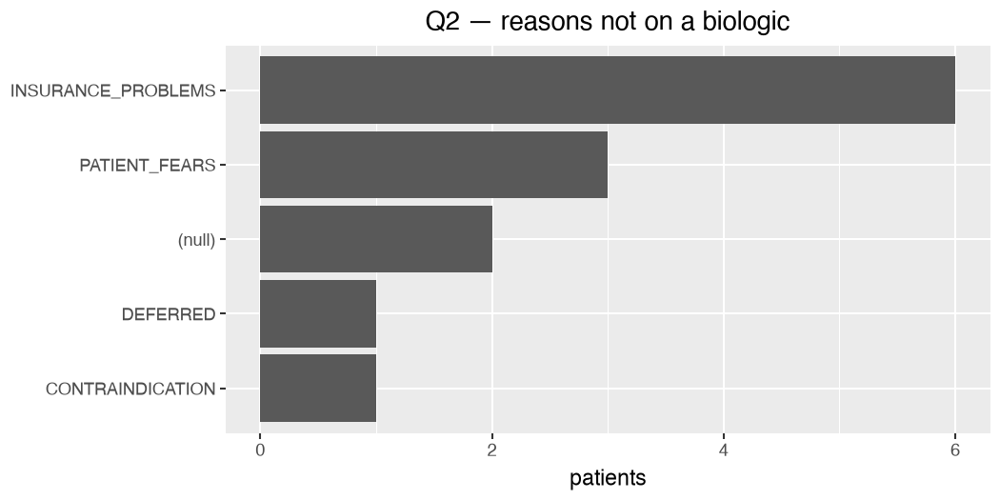
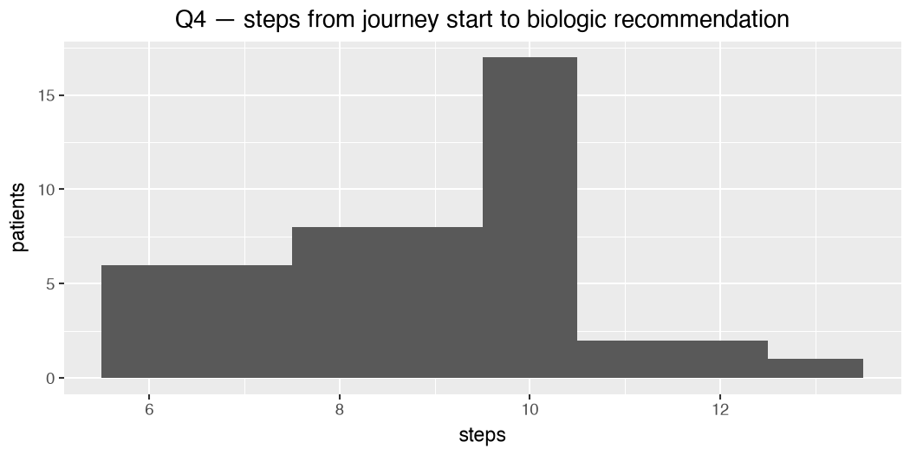

# Crohnicity: Mama Health Challenge


<!-- Source of truth: edit README.qmd, then `uv run quarto render README.qmd` to regenerate
     README.md (gfm) + README.html (local verification). The analysis chunks read only the
     persisted predictions in data/out/ — no Gemini API calls. -->

***Crohnicity*** = **Crohn’s** + **chronicity** — the disease and its
time dimension. Crohn’s is a chronic, lifelong condition, and the Mama
Health AI companion records each patient’s treatment journey
**longitudinally over time**, so the temporal axis is central to the
data.

## Pydantic Schema Design

- Which fields should be **enums** vs. **free text** vs. **structured
  objects** (e.g., a list of treatment records with name, class,
  outcome, reason_stopped)?
- How do you distinguish **“not mentioned”** from **“explicitly
  denied”** from **“cut off before we could find out”**? These are three
  very different states and they matter for the analysis.
- How do you capture **evidence** — a supporting snippet, turn
  reference, or rationale per extracted field — so a reviewer can audit
  the model’s decisions?
- Socio-demographic fields: what’s worth extracting, what’s noise?

**Answers (provisional).**

- **Enums vs. free text vs. objects.** Closed vocabularies the analysis
  groups on are **enums** — `TreatmentOutcome`, `ReasonPrescribed`,
  `ReasonNotTaken`, `ComorbidCondition`, `PathwayStep` — so
  `value_counts`/joins get stable categories and membership is checked
  at the model boundary (`enforce_validation`). Open, high-cardinality,
  not-yet-canonical fields stay **free text**: `biologic_type`,
  `TreatmentRecord.name`/`treatment_class` (a branded-drug +
  treatment-class registry is future work — `docs/TODO.md`). Repeated,
  multi-attribute things are **structured objects/lists**:
  `treatment_records` (a list of `TreatmentRecord`, each carrying
  `before_biologic`, the flag that answers Q3), `demographics`, and
  `referral_pathway` (`list[PathwayStep]`). The visible cost of the
  free-text choice shows up in the **Q3 table** —
  `conventional_therapy`/`conventional` and case variants are one class
  left un-normalised.
- **Three states, not one null.** “Not mentioned” (absence), “explicitly
  denied” (negation) and “cut off” (truncation) are kept as *separate*
  signals rather than collapsed into a null: absence →
  `biologic_not_mentioned` + null/empty fields + `NOT_MENTIONED`;
  negation → the `biologic_prescribed` vs. `biologic_taken` pair + a
  specific `ReasonNotTaken` (`EXPLICIT_DENIAL`/`INSURANCE_PROBLEMS`/…);
  truncation → `churn` + `JOURNEY_CUT_OFF`. A `NOT_APPLICABLE` member
  marks “genuinely doesn’t apply” so it isn’t confused with a blank “not
  yet annotated” cell. This is the split the churn table under Q4
  operationalises.
- **Evidence / auditability.** The model **does populate
  `evidence_notes`** — a free-text rationale per patient (all 50
  predictions carry one, e.g. *“cycled through Remicade, Humira due to
  loss of response; currently on Stelara; injection anxiety”*). What’s
  **deferred is the manual side**: the gold annotation keeps
  `evidence_notes` as an unfilled column (`docs/SCHEMA.md`), and
  structured **per-field** evidence — a snippet/turn-ref *per field*
  rather than one blob — is stretch task 2 (it costs tokens + prompt
  complexity). The broader audit trail is the **logged raw model
  output** (`logs/extract.log` keeps the system prompt, schema, input
  and pre-validation response per call) plus the **gold-set comparison**
  (`docs/TO_REVIEW.md`).
- **Socio-demographics.** Deliberately minimal —
  `Demographics{gender, age}`, self-reported, grouped so a later “do
  pathways/outcomes differ by demographic” cut is possible; everything
  else is noise for these four questions.

## Extraction Pipeline

- **Single-shot vs. multi-stage extraction.** One big call, or a
  pipeline (e.g., identify-then-extract, or narrative-then-structured)?
  What are the tradeoffs?
- **Prompt design for uncertainty.** How do you instruct the model to
  separate absence, negation, and truncation?
- **Determinism and reproducibility.** Temperature, structured output
  mode, seed, caching — what did you pick and why?

**Answers (provisional).**

- **Single-shot, batched — not multi-stage.** One system prompt extracts
  *all* `PatientLabels` fields in a single structured call per patient;
  transcripts are then **batched** (10 per request) only to fit Gemini’s
  free-tier ~20-requests/day cap — batching ≠ staging, it’s still one
  pass over every field, just several patients per call. Single-shot
  minimises calls (decisive under the rate cap), keeps the code simple,
  and lets the model set inter-dependent fields
  (`biologic_prescribed`/`biologic_taken`, `churn`, `referral_pathway`)
  with the whole story in view. The cost: every field competes for
  attention in one prompt, so the hard fields suffer — the EDA shows
  `churn` unreliable and the GP node under-emitted. A multi-stage split
  (per-section prompts run concurrently, with inspectable intermediates)
  is the \#1 item in *Next Steps* below; it trades more calls +
  orchestration for better per-field accuracy.
- **Uncertainty: absence vs. negation vs. truncation.** The prompt
  separates them by construction, onto the three schema mechanisms
  above. A global rule — *“Leave a field null or empty when the
  transcript does not support a confident value”* — covers **absence**.
  **Negation** rides on the prescribed-vs-taken booleans + the
  `ReasonNotTaken` enum. **Truncation** gets the most explicit
  instruction: judge `churn` from how the transcript *ends*, treat a
  trailing “…” as a cut-off *only* if “…” isn’t a recurring stylistic
  device, prefer `false` when ambiguous, and — critically — *“keep this
  truncation signal distinct from a topic simply being absent … (that is
  ‘not mentioned’, not churn).”* Honest limit: truncation is a
  lexical/structural property of the transcript’s end that the narrative
  under-determines, so the instruction alone isn’t enough — the gold
  audit caught a false positive (P016) and a false negative (P049), and
  a deterministic tail-of-text rule would do better
  (`docs/TO_REVIEW.md`).
- **Determinism & reproducibility.** Three levers, in decreasing order
  of leverage. **(1) Structured-output mode** —
  `response_format={"type": "json_object", "response_schema": PatientLabels.model_json_schema(), "enforce_validation": true}`:
  a Pydantic-derived schema constrains the *shape* and enum membership,
  and LiteLLM validates the reply (raising `JSONSchemaValidationError`
  on a mismatch), so format/parse variance is removed and downstream
  pandas never meets an off-vocabulary value. **(2) Persisted
  predictions** — each chunk writes one validated JSON per patient to
  `data/out/`, and the whole analysis (this README) reads *only* those
  frozen artefacts with no API call, so every number and plot is
  **exactly reproducible run-to-run** regardless of LLM nondeterminism;
  this is the real guarantee. **(3) Decoding params** — `temperature` is
  left at the provider default this iteration; pinning it to `0`
  (greedy) and adding a seed where Gemini honours it is the open
  determinism step (`docs/TODO.md`), though with a reasoning-capable
  model bit-exact output isn’t guaranteed anyway, and (1)+(2) already
  remove the variance that affects the answers. No explicit prompt
  **caching** yet — the static system prompt + schema are identical
  across calls, so implicit context caching may apply, and cached-token
  counts are logged (`docs/TELEMETRY.md`).

## Evaluation

Pick **one** approach that gives you a real signal on quality. We don’t
need a rigorous eval harness — we want to see you know how to probe your
own pipeline:

1.  **Mini golden set:** hand-label 5–10 transcripts yourself on key
    fields, compute agreement with the model, **or**
2.  **LLM-as-judge:** a second LLM call scoring extraction fidelity on a
    sample against the source transcript, **or**
3.  **Consistency check:** run extraction twice (different prompts,
    temperatures, or models) and use disagreement as a proxy for
    reliability.

Write up what it told you in a few lines: what the pipeline is solid on,
where it’s shaky, what you’d fix first with more time.

I picked (1).

**What it surfaced (provisional).** Gold labels live in
`interviews_ground_truth_v5.ods`, scored on the `to_review` validation
split (19 cases with a non-null label). Headline: `biologic_taken` — the
field Q1 rests on — scores **F1 = 0.95** (precision 0.90 / recall 1.00),
computed inline under Q1 below, so the “% on a biologic” answer is
well-supported. Where it’s shaky: **`churn`** is unreliable in both
directions (a false positive *and* a false negative in the gold audit —
`docs/TO_REVIEW.md`) because truncation is a lexical/structural signal
the narrative under-determines; **`treatment_class`** drifts
(un-normalised free-text categories inflate the Q3 count); and the **GP
node** (`primary_care_contact`) is under-emitted (9/50), weakening the
strict Q4 step count. Fix-first order: a deterministic tail-of-text
churn rule, a treatment/biologic registry to normalise classes, and a
larger, multi-annotator gold set — today’s is single-annotator over
19/50, so the metric carries real sampling uncertainty.

## Analysis

A short answer to PharmaCorp’s four questions. Numbers with ranges or
caveats where sensible. Keep it tight — the point is to demonstrate the
structured output is usable, not to write a consulting deck.

1.  What percentage of patients in the dataset appear to be on a
    biologic?
2.  For patients *not* on a biologic, what are the primary reasons
    (doctor choice, patient fears, cost, access, something else)?
3.  What other treatments are commonly tried or discussed before a
    biologic is considered?
4.  What does a typical referral pathway look like, in number of steps
    from GP to a specialist who can prescribe a biologic?

### Answers

Computed from the persisted predictions in `data/out/` (`n = 50`).

#### Q1 — % on a biologic

| status                | patients | pct |
|:----------------------|---------:|----:|
| on a biologic (taken) |       37 |  74 |
| not on a biologic     |       13 |  26 |

74% of patients (37/50) appear to be **on a biologic**
(`biologic_taken == true`).

*Evaluation — mini golden set.* `biologic_taken` (the field Q1 rests on)
scored against the hand-annotated gold in `_v5.ods` (the `to_review`
cases), as precision / recall / F1:

| metric    | value |
|:----------|------:|
| precision |   0.9 |
| recall    |     1 |
| F1        | 0.947 |
| accuracy  | 0.947 |
| n (gold)  |    19 |

On the 19-case golden set, `biologic_taken` scores **F1 = 0.95**
(precision 0.9, recall 1.0; TP/FP/FN/TN = 9/1/0/9) — so the Q1 headline
is well-supported by the gold.

*Limitation.* This is measured only on the hand-annotated gold
(`to_review`) split — **19 of 50** patients (those with a non-null
`biologic_taken`) — so the metric carries real **sampling uncertainty**
(a few flips would move it noticeably), and the gold is a
**single-annotator judgement** with its own error. A trustworthy
at-scale accuracy estimate would need a larger, ideally multi-annotator
audit set (a bigger `…_v*.ods`); see `docs/TODO.md`.

#### Q2 — reasons not on a biologic

| reason             | patients |
|:-------------------|---------:|
| INSURANCE_PROBLEMS |        6 |
| PATIENT_FEARS      |        3 |
| (null)             |        2 |
| DEFERRED           |        1 |
| CONTRAINDICATION   |        1 |



#### Q3 — treatments tried before a biologic

    | treatment_class      |   mentions |
    |:---------------------|-----------:|
    | conventional_therapy |         26 |
    | conventional         |         23 |
    | aminosalicylate      |         22 |
    | corticosteroid       |         16 |
    | Immunosuppressant    |         11 |
    | 5-ASA                |         10 |
    | Corticosteroid       |          7 |
    | immunomodulator      |          6 |
    | immunosuppressant    |          4 |
    | biologic             |          2 |
    | Diabetes medication  |          1 |
    | hormonal therapy     |          1 |
    | analgesic            |          1 |
    | hormone replacement  |          1 |
    | antibiotic           |          1 |


#### Q4 — referral pathway length (steps to a biologic-prescribing specialist)

> **Caveat.** The literal “GP” node (`primary_care_contact`) appears in
> only 9/50 predicted pathways, so a strict GP→prescriber count isn’t
> representative. We count steps from the journey **start** (or
> `primary_care_contact` where present) to `biologic_recommended`
> (present in 50/50) — the point a biologic-prescribing specialist is
> reached. Under-emission of the GP node is a prompt-fix candidate (see
> `docs/TODO.md`). Per-case journey graphs:
> `data/out/referral_pathway_P*.html`.

| steps | patients |
|------:|---------:|
|    10 |       17 |
|     9 |        8 |
|     8 |        8 |
|     6 |        6 |
|     7 |        6 |
|    11 |        2 |
|    12 |        2 |
|    13 |        1 |



The **most common** journey length is **10 steps** (the modal value —
highest patient count in the chart), with a **median of ~9** (range
6–13, n=50).

Crucially, **21/50 journeys are cyclic** — the patient loops back
through relapse / `loss_of_response` / `biologic_switch` (recurrence the
prompt now captures; the per-case graphs in
`data/out/referral_pathway_P*.html` render these as loops). So “a
typical referral pathway” is as much about **recurrence** (repeated
biologic switching) as about step count — a linear step number alone
understates the journey for the **42%** of patients whose journey loops.

**Churn handling matters here.** Be explicit about:

- How many journeys in your output look truncated vs. complete, and how
  you decided.
- How you separated “biologic not mentioned” from “biologic discussed
  and rejected” from “patient churned before reaching that point.”
- Which of the four answers are most and least trustworthy given the
  churn distribution, and why.

| state                              | patients |
|:-----------------------------------|---------:|
| biologic not mentioned (absence)   |        0 |
| discussed but not taken (negation) |       13 |
| churned / truncated                |        0 |

The model flagged `churn = true` for only **0/50** patient(s). Manual
review of the flagged/edge cases (`docs/TO_REVIEW.md`) found churn
detection unreliable in both directions — a false positive (P016) and a
false negative (P049) — because truncation is a lexical/structural
property of the transcript’s *end* that the narrative under-determines.
**Q1 and Q3 are the most trustworthy** answers (they depend on facts
stated early); **Q4 is the least** (it depends on the full pathway
surviving, and on the under-emitted GP node).

### Churn — definition & handling

**Definition.** The spec never defines the “interview”. We read it as
the patient’s interaction with the Mama Health AI companion app —
patients describe their doctors in the *third person*, so they’re
narrating *to the app*, not conversing with a clinician. **Churn is
therefore disengagement from that app interaction**, which in the data
shows up as a transcript that stops early. The spec backs this:
*“patients disengage partway through their interview — they churn —
leaving us with truncated journeys”*, and the transcripts vary in
*“completeness… some cut off mid-journey”* (with a worked “incomplete,
likely churn” example).

**One flag, not two.** Because “churned” and “incomplete journey” are
the *same* signal under this reading, we collapse them into a single
`churn` field (ground truth `…_v4.ods` drops `incomplete_journey`).
`churn = true` when there’s evidence of **(a)** disengagement from the
app interaction, or **(b)** a truncated / cut-off / vague narrative.
Signals: completeness, cut off mid-journey, truncation, vagueness.

**Why this matters for the answers.** `churn` is the *truncation* state
that, with `biologic_not_mentioned` (absence) and a
discussed-but-not-taken biologic (negation), gives the three-way split
the analysis needs — “not mentioned” vs “discussed and rejected” vs
“churned before we could find out”. It stays a judgement call with
residual uncertainty, but a single honest flag beats splitting two
overlapping ones.

## Evaluation Criteria

- **Schema judgment.** Does your Pydantic model capture the real shape
  of the problem, including its messiness and uncertainty?
- **Pipeline engineering.** Clean, typed code, sensible error handling,
  defensible choices on prompting, retries, validation, reproducibility.
- **Uncertainty handling.** Do churn, ambiguity, and absent information
  show up as first-class signals in your output, or do they silently
  collapse into nulls?
- **Evaluation mindset.** Do you know whether your pipeline is actually
  working, and how you know?
- **Communication.** A README where a reader can understand your
  assumptions, tradeoffs, and limits in under 5 minutes.

We’re **not** looking for: - A perfect extractor — the data is
intentionally hard. - Production-grade architecture. - A sprawling
business-insights writeup.

## Deliverables

A link to your forked, completed GitHub repo containing:

1.  Source code in `src/`.
2.  Tests in `tests/`.
3.  `requirements.txt`.
4.  A **`README.md`** with:
    - Your four business answers (brief, with caveats).
    - A pipeline design section — schema choices, prompting approach,
      error handling, reproducibility.
    - Your evaluation approach and what it surfaced.
    - Churn / limitations discussion.
    - Your “where I used AI” note.

## Optional stretch tasks

Only if you have spare time. We’d rather see a tight core than a bloated
stretch:

1.  **Multi-stage or chain-of-thought prompts** with inspectable
    intermediate artifacts.
2.  **Confidence scoring per field**, either self-reported by the LLM or
    derived from consistency across samples.
3.  **Open-source model** — swap in a local model (Qwen, Llama, etc.)
    for one stage via `litellm` and compare quality/latency/cost.
4.  **Sankey or pathway visualization** for the referral journey.
5.  **Dockerfile** for reproducibility.

I’ve attempted (4) as a way of answering business question (4) on
referral pathways.

## Next Steps

With more time, after the core is complete:

- **Split the single system prompt into multiple focused prompts run
  concurrently.** This version deliberately uses one prompt; a later
  iteration would break extraction into per-section prompts
  (e.g. biologic funnel, treatment history, referral pathway) run in
  parallel — better per-field accuracy and inspectable intermediate
  artifacts, at the cost of more calls and orchestration.
- **A telemetry feature for optimisation.** Per-call usage is currently
  logged (tokens, cost, cached tokens — see
  [docs/TELEMETRY.md](docs/TELEMETRY.md)); with more time I’d surface it
  as a first-class artifact (a structured per-run metrics file + plots)
  to track cost/latency/cache-hit rate and tune the pipeline at scale.
- **Try a larger Gemini model in production.** This version uses
  `gemini-2.5-flash-lite` (cheap, fast for iteration). With more time
  I’d evaluate a more capable model (e.g. `gemini-2.5-flash` / `pro`)
  for extraction quality, weighed against its free-tier **request/token
  rate limits** (the ~20 calls/day cap that drove the chunking design)
  and cost.
- **Deep dive on cyclical journey patterns.** The `referral_pathway`
  initially flattened recurrence (each phase emitted once); the prompt
  now asks the model to repeat steps when phases recur. A proper
  follow-up would analyse the *cyclicity* itself — how many biologics
  patients cycle through, repeated relapse / loss-of-response / switch
  loops, time-to-switch — and classify journeys as genuinely cyclic vs
  linear (the recurrence is also recoverable from `treatment_records`).
- **Productionise as a FastAPI inference endpoint (deployment MVP).**
  Wrap `extract()` in a **FastAPI** service (already a declared
  dependency): `POST` an `interview_transcript`, get back a validated
  `PatientLabels` JSON generated **dynamically by a cloud-hosted model**
  — turning the current offline batch CLI into a real-time production
  inference path. Package the API **into the Docker image** (the
  Packaging item in `docs/TODO.md`) so one container serves it, and ship
  it via **CI/CD to a cloud service** for an always-on, auto-deployed
  endpoint.

## Where I used AI

TBA

## Usage

Run the extraction pipeline via the `src/main.py` CLI (python-fire).
**By default it extracts all 50 transcripts in chunks of 10 → 5 API
calls**, sized to the Gemini free tier’s ~20 requests/day cap (taken as
a fixed constraint; 50 one-at-a-time calls would exceed it).

``` bash
uv run python src/main.py                          # all 50, chunks of 10 (5 calls)
uv run python src/main.py --limit=10               # run 1 only: P001–P010
uv run python src/main.py --limit=10 --offset=10   # run 2: P011–P020 (no re-run of earlier chunks)
```

| Flag | Default | Purpose |
|----|----|----|
| `--model` | `gemini/gemini-2.5-flash-lite` | swap model (Gemini ↔ local Ollama, e.g. `ollama_chat/qwen3:30b-a3b`) |
| `--limit` | all | slice size — run one chunk for testing / incremental runs |
| `--offset` | `0` | which slice — incremental runs without redoing earlier chunks |
| `--chunk-size` | `10` | transcripts per API call |
| `--out-dir` | `data/out` | route test runs to `data/out/tests` so they don’t clobber production |

The post-extraction EDA (this README’s tables/plots) is generated by
`uv run quarto render README.qmd`, which reads only `data/out/` —
**independent of the Gemini API**. Each chunk persists its predictions
(one JSON per patient) as soon as it validates, so a completed chunk is
durable and `--offset` lets you resume/retry without re-spending calls.
Per-call telemetry (tokens, cost) is logged to `logs/extract.log`.

### Referral-pathway graphs

Generate the per-case journey graphs + phase/transition tables behind Q4
(reads the pathways, no API call):

``` bash
uv run python src/referral_pathway_analysis.py   # writes data/out/referral_pathway_P*.html
```

### Rebuild the answers doc

``` bash
uv run quarto render README.qmd                  # regenerate README.md (gfm) + README.html from data/out/
```

### Development — quality gate

Run the manual gate on every code change (no pre-commit hooks, by design
— see `CLAUDE.md`):

``` bash
bash tests/type_lint_unit_tests.sh   # ruff check + ruff format --check + ty check + pytest (src + tests)
```

…or the individual tools:

``` bash
uv run ruff check src tests                            # lint
uv run ruff format src tests                           # auto-format
uv run ty check src tests                              # type-check (Rust-based; not mypy)
uv run pytest -q                                       # unit tests
RUN_RENDER_TEST=1 uv run pytest tests/test_render.py   # gated end-to-end render smoke test
```

### Docsite (API reference)

Preview the mkdocstrings API site locally — it regenerates from the
docstrings on every build:

``` bash
uv run mkdocs serve   # live preview at http://127.0.0.1:8000
uv run mkdocs build   # render the static site to site/ (gitignored)
```

## Data handling & privacy

> ⚠️ **This repo commits `data/in/` and `data/out/` (model inputs and
> outputs) to git — which you should NOT do in a production system.**
> Real patient interview data and extracted records are **personal /
> special-category health data** under GDPR and must never be pushed to
> GitHub or any external version control — PII exposure, data-residency,
> retention, and access-control all forbid it.
>
> It is acceptable **here only** because the dataset is **synthetic**,
> the repo is **private**, and committing the data + outputs makes this
> **internal job-interview take-home auditable** end-to-end by the
> reviewer. In production, inputs/outputs would live in secure storage
> under a data-processing agreement and **only code** would be
> version-controlled. See [docs/QUESTIONS.md](docs/QUESTIONS.md) \#7.

## Requirements

Dev environment requirements and setup — Python 3.14 (via uv), a
`GEMINI_API_KEY`, and the VS Code + Claude Code extension diff-review
workflow — are documented once in
[docs/DEV_SETUP.md](docs/DEV_SETUP.md); this README only links there to
avoid duplication.

Further documentation is provided as follows:

- [CLAUDE.md](CLAUDE.md) for Claude Code project instructions.

- [DEV_SETUP.md](docs/DEV_SETUP.md) for installation and usage guide for
  users and devs.
